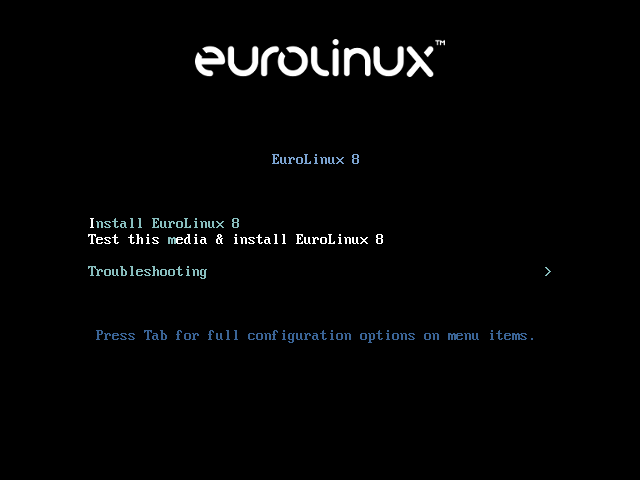
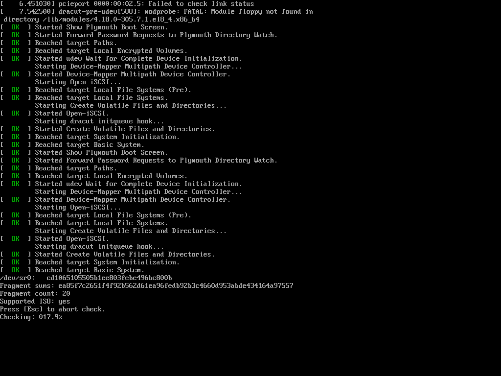
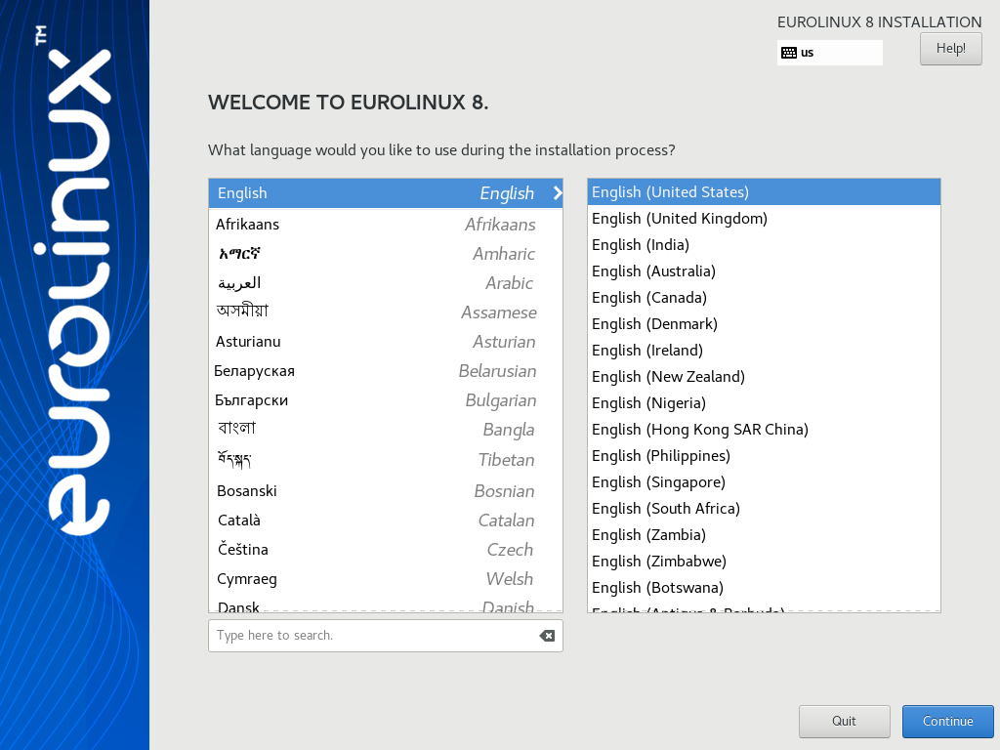
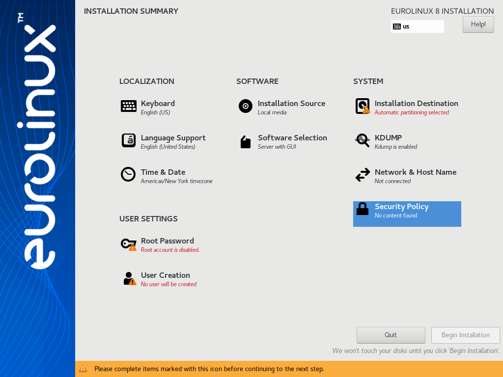
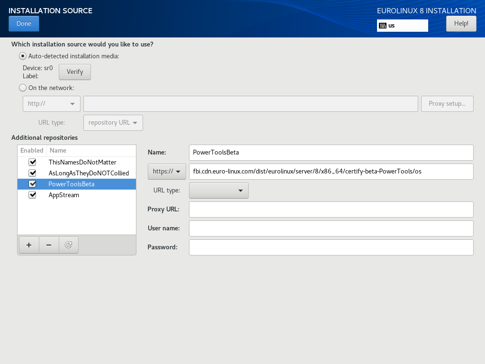
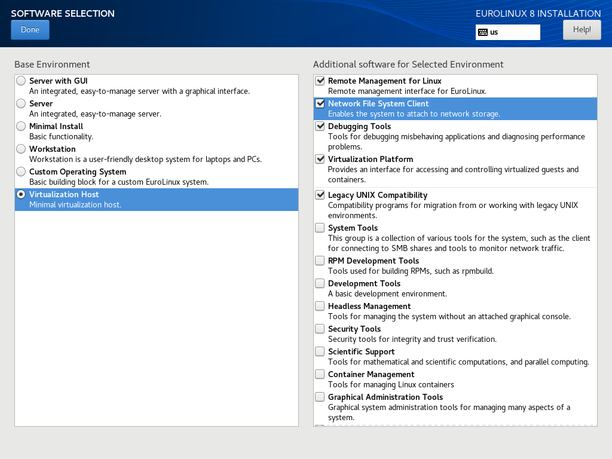
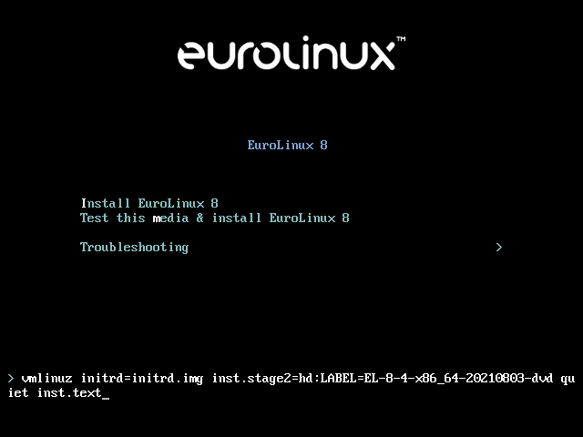
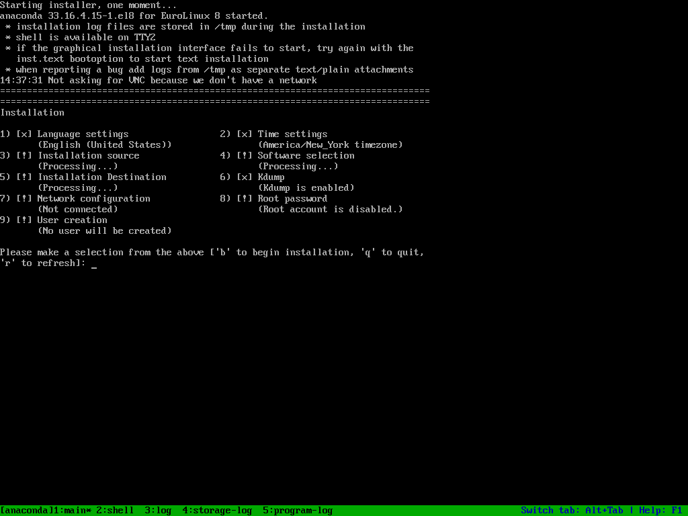
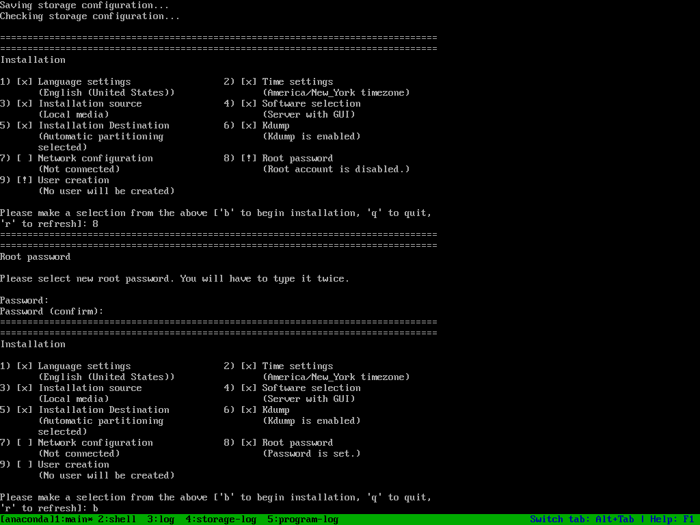

# EuroLinux 8 Jump Start

This document contains the necessary information to set up your first EuroLinux
8 installation. 

## System Requirements

### x86_64 (64 bit AMD/Intel architecture)

Minimal and recommended requirements are following:

| Resource | Absolute minimal requirements for cloud deployment |  Minimal |  Recommended |
|----------|--------|------|---|
| Logical CPU | 1 | 1 | 1 |
| RAM  | 768MB or 512MB with swap space|  1 GB  | 1.5 GB per logical CPU |
| Storage | 5 GB (excluding swap)| 10GB | 20GB |

Logical CPU means Physical CPU (including Hyper-Threading) or vCPU (virtual
CPU). 

!!! warning
    It might be impossible to install EuroLinux on a system that does not meet
    recommended requirements.

### aarch64 (64 bit ARM architecture)

Minimal and recommended requirements are following:

| Resource | Absolute minimal requirements for cloud deployment |  Minimal |  Recommended |
|----------|--------|------|---|
| Logical CPU | 1 | 1 | 1 |
| RAM | 1 GB or 512MB with swap space |  2 GB  | 2 GB per logical CPU |
| Storage | 5GB | 10GB | 20GB |

#### About absolute minimums for cloud deployment

During our internal testing, we were able to boot and use very basic and
already installed services on Virtual Machine with only 256 MB of RAM. However,
without additional memory or at least swap space available, things like
updating the system will result in actions of Kernel Out of Memory (OOM)
Killer.


You can try it yourself with [EuroLinux Vagrant
boxes](https://app.vagrantup.com/eurolinux-vagrant) and following Vagrantfile:

```ruby
Vagrant.configure("2") do |config|
  config.vm.box = "eurolinux-vagrant/eurolinux-8"

  # Explicitly disable vbguest because we are using rsync
  if Vagrant.has_plugin?("vagrant-vbguest")
      config.vbguest.auto_update = false
  end

  config.vm.provider "virtualbox" do |vb|
    vb.memory = "256"
    vb.cpus = 1
  end
  config.vm.provider "libvirt" do |vb|
    vb.memory = "256"
    vb.cpus = 1
  end
end
```

It's also possible to install EuroLinux on less than 5 GB of space, but it also
requires extra attention.

All absolute minimums for cloud deployments described above are not officially
supported by EuroLinux.

### Secure boot

At the moment, EuroLinux does not support secure boot. The full secure boot
support is planned at the end of Q3/beginning of Q4.

## How to install EuroLinux 8 from ISO

### Where can you obtain ISO?

We distribute EuroLinux in a responsible open core model. Because of that, you
might download EuroLinux from different sources. The two primary sources are:

- [https://fbi.cdn.euro-linux.com/isos/](https://fbi.cdn.euro-linux.com/isos/)
  open for everyone
- [https://customerportal.euro-linux.com](https://customerportal.euro-linux.com)
  for EuroLinux customers

The only difference is that Customer Portal keeps older versions, when CDN,
that is used for mirroring, keeps only two of the latest ISOs for each version
to save space (single EuroLinux AppStream ISO might take up to 10 GB).


If you are running a huge deployment, you might consider setting up your own
mirror and download ISOs from Intranet.

### How to check ISO integrity

During download, many things can happen - from a network or sending host
failure to single-bit error. To check if ISO is undamaged, there are two
mechanisms in place.

* For each EuroLinux ISO there's a file with its checksums and appropriate
  digest algorithms. Its name says, which algorithm was used to calculate the
cryptographic digest. For example, you can browse
[https://fbi.cdn.euro-linux.com/isos/](https://fbi.cdn.euro-linux.com/isos/)
and read the `sha1sums.txt` file.


When the ISO download is completed, you can invoke the `sha1sum` command on the
ISO file and check if checksums match.

```
[Alex@SpaceShipEL8 Downloads]$ sha1sum EL-8.3-x86_64-20210624-appstream.iso 
6a8abaaebe288553ec8568bd9de3f5fda5f1ddb5  EL-8.3-x86_64-20210624-appstream.iso
```

* The second mechanism for checking ISO integrity is built-in inside the
  installer itself. When you start the installation, use the `Test this media &
  install EuroLinux 8` entry:



After booting up, the ISO checking process will start.



### Installation with GUI

Because even a minimal installation uses a GUI the whole process is simple and
straightforward. EuroLinux 8, as well as previous versions, uses Anaconda
installer that clearly informs the user what needs to be done in order to
install the system. 

First, you have to choose the language that will be used during installation:


After configuring the installer language you should see a menu similar to:



#### Anaconda installer **LOCALIZATION** section:

- **Keyboard** - this section allows you to setup keyboard layouts, including
  the default keyboard layout, additional layouts and key combination to switch
  between them.
- **Language support** - additional languages packages that should be
  installed.
- **Time & Date** - configure the date, time zone, enable NTP and NTP servers.

#### Anaconda installer **SOFTWARE** section:

##### Configuring source of the installation

Here you might configure the source of your installation. By default, the
system installs from the ISO image itself. **This is one of the officially
supported ways to install EuroLinux**. 

If you enable a NIC (Network Interface Card) in the **Network** installer
section, you might add additional EuroLinux repositories and/or other
repositories. If you add EuroLinux repositories, the installer will
automatically download newer version of the packages.

EuroLinux 8 repositories:

- URL: `https://fbi.cdn.euro-linux.com/dist/eurolinux/server/8/$basearch/certify-BaseOS/os`  
  Name: BaseOSProd
- URL: `https://fbi.cdn.euro-linux.com/dist/eurolinux/server/8/$basearch/certify-AppStream/os`  
  Name: AppStreamProd
- URL: `https://fbi.cdn.euro-linux.com/dist/eurolinux/server/8/$basearch/certify-PowerTools/os`  
  Name: PowerToolsProd

For EuroLinux 8 beta:

- URL: `https://fbi.cdn.euro-linux.com/dist/eurolinux/server/8/$basearch/certify-beta-BaseOS/os`  
  Name: BaseOSBeta
- URL: `https://fbi.cdn.euro-linux.com/dist/eurolinux/server/8/$basearch/certify-beta-AppStream/os`  
  Name: AppStreamBeta
- URL: `https://fbi.cdn.euro-linux.com/dist/eurolinux/server/8/$basearch/certify-beta-PowerTools/os`  
  Name: PowerToolsBeta

!!! Warning "Limited support."
    **Hybrid network installation from both ISO and public repositories
    is not our primary goal in the QA process**. Packages in EuroLinux
    repositories are regularly updated, and it might be impossible to
    install a system from an external source. Depending on the state of the
    upstream, we might not fix a potential issue.

Below you can see an example configuration that was used to install a system:



After changing the installation source, you will have to confirm **Software
Selection**.

##### Software Selection

Software Selection allows you to customize which packages will be installed.
You might choose from base environment groups like *Server with GUI*,
*Workstation* or *Minimal*. You can also install additional package groups.



#### Anaconda installer **SYSTEM** section:

- **Installation selection** allows choosing on which disk the system will be
  installed. If you want to have a fully encrypted system, you should enable
  encryption in this step.
- **KDUMP** allows choosing if KDUMP (Kernel crash dump collection mechanism)
  should be enabled.
- **Network & Hostname** - you can configure your system networking here
- **Security policy**  - you can setup an additional openscap policy here

#### Anaconda installer **USER SETTINGS** section:

- **Root Password** - by default, the root user is disabled. If a user is
  created in **User Creation** section, the root account can stay disabled
- **User Creation** section allows creating a regular user in the system. If
  the *Make this user administrator* option is checked, the root account can be
  disabled.

**After applying all the necessary changes**, the installation can be started
with the "Begin Installation" button.


### Disk partition recommended minimums

You need at least the following partitions.

- `/boot` for Linux kernel and init ramdisks - 1GB
- `/` (root partition) - at least 10 GB (a very minimal system might use as
  little as 2GB - but it requires extra attention and is not officially
  supported by EuroLinux)

For UEFI, an EFI system partition is also required.

- `/boot/efi`  - at least 100MB

If your storage allows it, the following partitions are also highly
recommended:

- `swap` - 1GB or more depending on the system RAM and workload. Swap is also
  required for hibernation. Depending on the workload of the system, it should
  be at least as spacious as system RAM.
- `/home` - at least 1GB - but in most cases, if `/` can be as big as 80GB,
  then `/home/` usually takes the rest of the free space

### Installing EuroLinux in basic graphic mode

Suppose there is a problem loading/running your graphics card driver (it might
results in a black screen/error message or graphical artifacts). It's possible
to install EuroLinux in basic graphics mode.

To do so, choose `Troubleshooting` on the welcome menu, and then *Install
EuroLinux 8 in basic graphics mode*.

From this point the process is identical to a standard installation with GUI.

### Installing EuroLinux in text mode

To install EuroLinux in text mode:

- Boot EuroLinux ISO
- Press ++esc++ to stop installation options selection timeout
- Press ++tab++
- Add `inst.text` to the end of the kernel boot command line
- Press ++enter++



Before running the installation you have to provide all the necessary
information (represented as `!` in selection). It's a good idea to refresh the
menu with ++r+enter++ command shortly after the installer started.



After customization you are ready to start your installation.



### Other possibilities

EuroLinux can also be installed in the following manner:

- Automated installation with a kickstart file.
- Installation with PXE
- Installation via VNC

Please consult upstream documentation about these topics.

## Using EuroLinux

From this point, you can use EuroLinux as any other RHEL™ based distribution.

### Submitting a Request for Change

We truly care. If there is something that you believe could/should be
changed/improved in the EuroLinux distribution and does not break compatibility
with the upstream project, then drop us the issue on GitHub! All contributors
are extremely welcome.

[EuroLinux Distro Bugs and
RFC](https://github.com/EuroLinux/eurolinux-distro-bugs-and-rfc/)

### Submitting a Bug report

We decided that submitting bug reports should not involve
registration into some nasty miserable software. At the very same
time, we know that most open-source developers have GitHub profiles.
This choice makes the decision making and work as transparent as
possible. That's why we decided to use it as the primary way to
submit bugs.

[EuroLinux Distro Bugs and
RFC](https://github.com/EuroLinux/eurolinux-distro-bugs-and-rfc/)

This repository allows you to stay in **direct contact** with EuroLinux
developers.

#### Other ways to submit a bug report

- `support AT euro-linux dot com`
- [EuroLinux Support Portal (subscription
  required)](https://support.euro-linux.com)

#### Security/confidential bug report

Please use the e-mail provided above.
