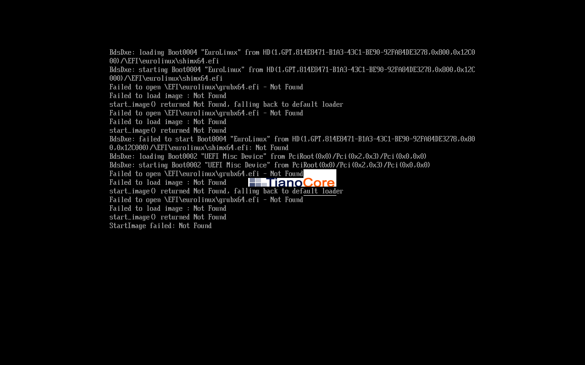
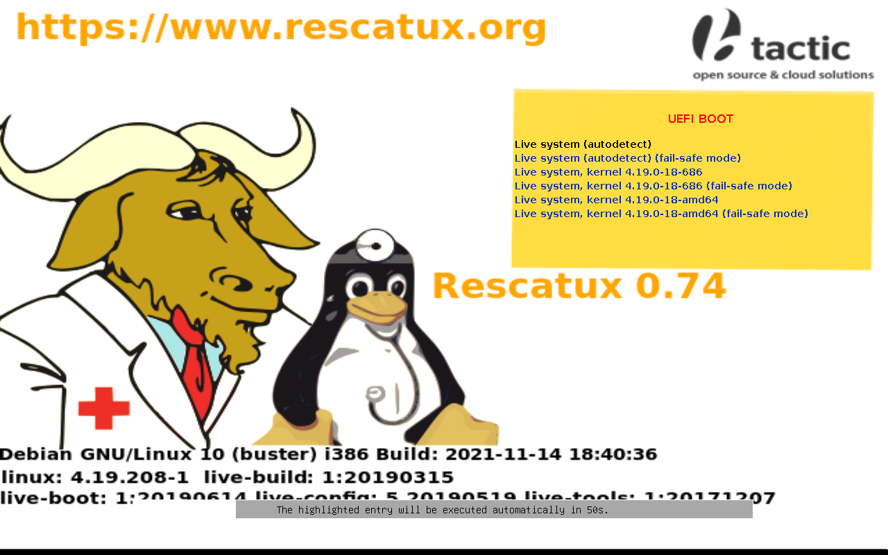
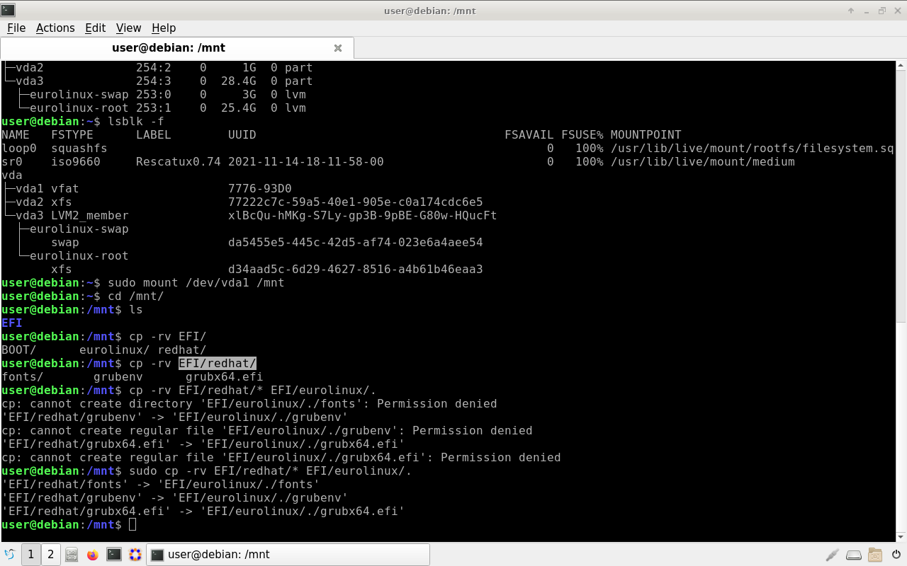
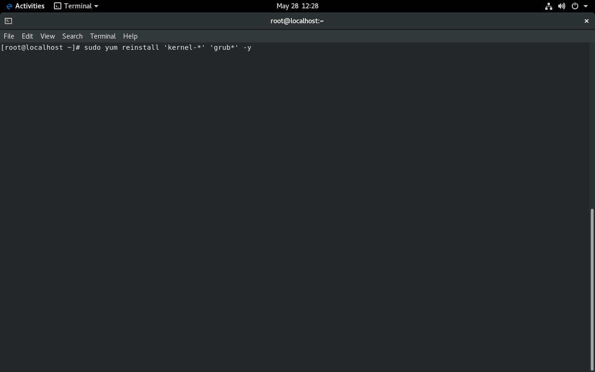

# Black Screen After update to EuroLinux 8.10 - EFI problem

## Background

We are deeply sorry to inform you that one of the packages in EuroLinux 8.10
created a severe mistake in the boot configuration. The package grub2-efi-x64
was copied from a never-released beta repository, and it was not supposed to be
there in that version.


If you updated your system:

- before May 28th, 13 CET
- and you are using EFI

The following error might appear after booting your system.

```
error: file `/EFI/eurolinux/grubx64.efi` Not Found.
```

and other similar errors, like:

```
StartImage failed
```

Generally speaking, the system won't boot into the bootloader (GRUB).
Depending on your UEFI software, you might see different error messages.


Depending on your UEFI software you might be able to boot system normally. If
you can boot system you can fix the problem by reinstalling the `grub2-efi-x64`
package. 



## When this problem does not occur

- If you are using a VM that does not use EFI you won't have this problem
- If you are using legacy BIOS and the system was installed as legacy BIOS
- Container images and other images


## Update after May 28th, 12 CET


If you are updating your system with a repository synced after May 28, 13 CET,
you should not have this problem. The package was removed and overwritten from
the repository, and the proper package was added.


## Updated but not rebooted system
If you updated but have not rebooted the system -> please reinstall the
grub2-efi-x64 package and kernel packages:

```
sudo yum clean all
sudo yum reinstall -y `kernel*` `grub2*`
```

## ISO files

The ISO files were updated, and the previous ISO was removed. The new ISO is
supposed to be released today (May 28th).

## Revert from backup/snapshot

If you can, please revert from the backup or snapshot to version 8.9. The
update process now contains overwritten, updated and proper packages, and this
problem will not occur.

## Rescue system with wrong EFI from a live CD.

1. Download LiveISO CD
2. Change boot order (if necessary)
3. Mount ISO/Create ISO on the pendrive
4. Start system from ISO
5. Mount the EFI partition
6. Copy the EFI files
7. Run system normally
8. Reinstall kernel-core and grub2-efi-x86


## Download LiveISO CD

One of the smallest ISO and well-known projects is Rescatux. You can download
it from:
https://sourceforge.net/projects/rescatux/files/rescatux-0.74/rescatux-0.74.iso/download


You can use different ISOs, such as our Desktop Live or Ubuntu.

## Change the boot order (if necessary)

Changing the boot order might be necessary for both VM and Physical Machines.

## Mount ISO/Create ISO on pendrive

Mount rescue ISO to a VM. For physical machines, create a bootable pendrive
with the ISO. The process is similar to creating a bootable pendrive for
installation.

After mounting or inserting the pen drive, start the rescue/live CD system.

## Starting rescuetux or other livecd

You can safely start Rescuetux or another live CD. The process is similar to
getting a standard desktop. You can safely skip any questions and programs and
get straight to the terminal.




## Find and mount the EFI partition

Finding an EFI partition is quite straightforward use one of the following commands:

```
sudo lsblk
```

Example efi partition output

```
/dev/nvme0n1p5: UUID="2A1E-AC26" TYPE="vfat" PARTLABEL="EFI System Partition" PARTUUID="6b15bd77-bb2e-4393-9fbb-445625660679"
```

or

```
lsblk -f
```
Example EFI partition output

```
vda1 vfat               776-93D0
```

After finding the EFI partition, mount it to a temporary location. In the
example bellow, we are using `/mnt` as a temporary location, and partition is
the `/dev/vda1`

```
sudo mount /dev/vda1 /mnt
```

Confirm the EFI partition is mounted correctly and contains EFI directory

```
cd /mnt/
ls
```

The output should contains at least an EFI directory

```
EFI
```

## Copy the EFI files

```
sudo cp -r /mnt/EFI/redhat/* /mnt/EFI/eurolinux/.
```


## Reboot system

Depending on the live CD/ISO you used, you might need to reboot the system or exit the live CD.

```
sudo reboot
```
in most cases, is enough. You can also shut down the system with shutdown -h now.


Before starting the EuroLinux system, remember to remove the rescue/LiveCD ISO
ISO or pendrive.


The whole process is as simple as the one on the screenshot:



## Running the system and reinstalling the packages


After rebooting the system you should be able to boot into the system in normall state. You can now reinstal the kernel
and grub packages.

```
sudo yum clean all
sudo yum reinstall -y `kernel*` `grub2*`
```



## Summary


Once more, we are deeply sorry for the inconvenience. The bug skipped our
testing and escaped into the public as we were changing the test structure to
support new features, including Secure Boot for EuroLinux 9.


We are working on improving our testing process to avoid such mistakes in the
future.


If you have any questions or need help, please contact us at support at
euro-linux.com. We will dispatch an engineer for a one-on-one session to assist
you.
